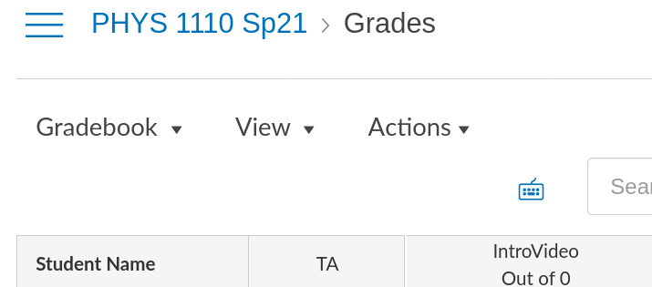

# gradebook-updater
## Purpose of the program 

This script is meant to automate the repetitive process
of checking attendance in the roster of an online Zoom
meeting and updating the CSV Canvas gradebook file.

It's unique requirement is python3. I've tested with
python3.8 and it seems to work fine.

## Usage

At the moment, the repository consists of two main forms of using the program:
a python script, very simple to use, and a web application.

### Web app

If you're looking for the web app version of this program, check

[https://pbmelo.github.io/gradebook-updater/web_app/main.html](https://pbmelo.github.io/gradebook-updater/web_app/main.html)

### Python script

Just launch a terminal and
type

`python ./update_grades.py`

It will query about the particular week of recitation, and
the path to the input files. The recitation week number is
self-explanatory and just an integer.

The program will then query the path to the old gradebook,
which is the CSV file exported from Canvas.

Go to https://canvas.colorado.edu/courses/69691/gradebook

Then it will ask you for the paths of the attendance files,
that can be downloaded from Zoom. Please remember to download
them using the "show unique users" option checked.

Go to https://cuboulder.zoom.us/account/my/report

Enter the path of the downloaded files into the program, and
Ctrl+D (EOF) when you're finished.

The program will output a file called
`Grades-PHYS_1110_Sp21-Updated.csv`
which can be promptly uploaded to Canvas.

## Important note

I'd strongly recommend checking if grades are properly
displayed on Canvas, because (from my very short experience)
both Zoom and Canvas tend to fetch buggy files sometimes.

## Goals

The script is very inchoate, and there's plenty of room for
improvement. I plan to write a simple (and optional) GTK GUI
where the user may just drop the files over a certain region
from their favorite file manager.

## LICENSE

Copyright (C) 2022 pbmelo

This program is free software: you can redistribute it and/or modify it under
the terms of the GNU General Public License as published by the Free Software
Foundation, either version 3 of the License, or (at your option) any later
version.

This program is distributed in the hope that it will be useful, but WITHOUT ANY
WARRANTY; without even the implied warranty of MERCHANTABILITY or FITNESS FOR A
PARTICULAR PURPOSE. See the GNU General Public License for more details.

You should have received a copy of the GNU General Public License along with
this program. If not, see <https://www.gnu.org/licenses/>.
